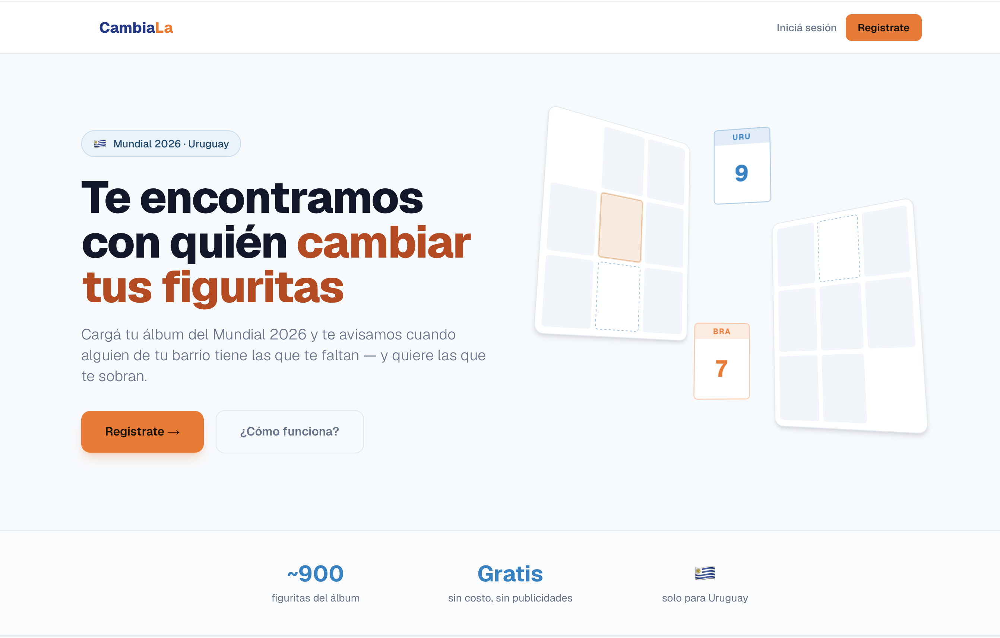

<h1 align="center">Hi, I'm Gonzalo Cabrera 👋</h1>

<b>Software Developer · Backend</b> &nbsp;·&nbsp; Montevideo, Uruguay 🇺🇾

  Backend-focused developer building with <b>C#</b>, <b>.NET&nbsp;8</b> and <b>SQL</b>. 
  💼 Software Developer Intern <b>@ Tata Consultancy Services</b> &nbsp;(Salesforce · Apex) 
  🎓 Computer Systems student <b>@ Universidad ORT</b> 
  🔭 Currently building <b>Cambiala</b>, a sticker-swap platform

  
  
  

<h3 align="center">🛠️ Tech Stack</h3>

  
  
  
  
  
  
  

<h3 align="center">⚽ Featured: CambiaLa</h3>

  <a href="https://cambiala.uy"><b>cambiala.uy</b></a> — a sticker-swap platform for the FIFA World Cup 2026 album, live in production in Uruguay 🇺🇾 
  Load your album and get matched automatically with nearby collectors who have what you need — and need what you have.

  
  
  
  
  

  

  Layered architecture (Presentation → Service → Repository → Domain) · pure matching engine at 100% enforced coverage 
  OTP + Google OAuth auth · transactional email · bulk album writes (40 clicks → 1 query) 
  <i>Solo-built, orchestrating a multi-agent AI pipeline: autonomous backlog runner + plan-mode supervision + adversarial code-review gates.</i> 
  Source private during beta — happy to walk through the architecture in an interview.

